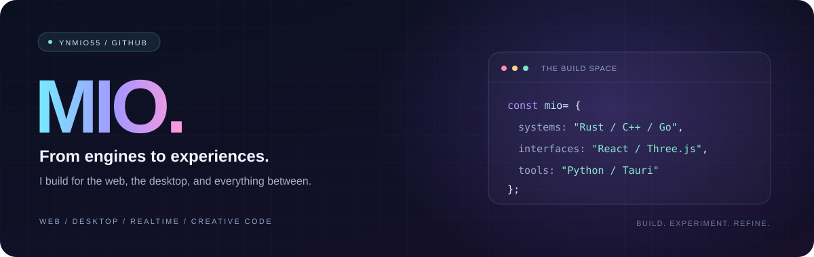

 

ผมชอบสร้างซอฟต์แวร์ที่มีทั้งหน้าตาที่ดีและโครงสร้างที่น่าสำรวจ  
ทำงานกับเว็บ แอปเดสก์ท็อป ระบบเรียลไทม์ และทดลองพัฒนาเอนจินเบราว์เซอร์

[GitHub](https://github.com/ynmio55?tab=repositories) &nbsp;·&nbsp; [LiteWave](https://litewave.miosmooth.com) &nbsp;·&nbsp; [Email](mailto:ngaolakhorny@gmail.com)

 

### Selected projects

**[LiteWave](https://github.com/ynmio55/LiteWave)** — เบราว์เซอร์สำหรับ Windows และ Linux  
Qt WebEngine พร้อมส่วนกรองคำขอด้วย Rust · C++ / Qt / Rust

**[WaveCore](https://github.com/ynmio55/WaveCore)** — เอนจินเบราว์เซอร์ที่ทดลองสร้างด้วย Rust  
แยกโมดูล HTML, DOM, CSS, layout และ rendering · อยู่ระหว่างพัฒนา

**[3D Web Story](https://github.com/ynmio55/3dwebmodel)** — เว็บเล่าเรื่องผ่านฉากสามมิติ  
กล้องเคลื่อนตามการเลื่อนหน้า พร้อมปรับแต่งโมเดลหัวใจ · Three.js / Vite

**NexTalk** — แอปแชตสำหรับกลุ่มส่วนตัว  
React client และ Go API พร้อม WebSocket / JWT / PostgreSQL · [Frontend](https://github.com/ynmio55/NexTalk_front) / [Backend](https://github.com/ynmio55/NexTalk_back)

**[Yabo Assistant](https://github.com/ynmio55/yaboassis)** — ผู้ช่วยคำสั่งภาษาไทยบนเดสก์ท็อป  
React / Tauri และ workflow สร้างตัวติดตั้ง · [การใช้งานและข้อจำกัด](https://github.com/ynmio55/yaboassis/blob/main/voice-os/README.md)

**[Gesture](https://github.com/ynmio55/gesture)** — ตรวจจับมือและท่าทางผ่านเว็บแคม  
Python / OpenCV / MediaPipe

 

### Tools I work with

**Web** &nbsp; React · Next.js · JavaScript · Three.js · Vite  
**Systems** &nbsp; Rust · C++ · Qt · Tauri · CMake  
**Backend & tools** &nbsp; Go · PostgreSQL · Python · OpenCV · GitHub Actions

 

### More experiments

[Lyric Studio](https://github.com/ynmio55/lyrics) — จับเวลาเนื้อเพลงและการ์ดเนื้อร้องลอย  
[Next Icons](https://github.com/ynmio55/icon-Next) — ธีมไอคอนสำหรับ editor  
[Yabotify](https://github.com/ynmio55/Yabotify) — โปรเจกต์เว็บ Next.js

 

<b>ดูว่าใช้เทคโนโลยีเหล่านี้ในโปรเจกต์ไหน</b>

 

| โปรเจกต์ | หลักฐานใน repository |
| :--- | :--- |
| LiteWave | [CMakeLists.txt](https://github.com/ynmio55/LiteWave/blob/main/CMakeLists.txt) — C++, Qt, CMake และการ build Rust |
| WaveCore | [Cargo.toml](https://github.com/ynmio55/WaveCore/blob/main/Cargo.toml) — Rust workspace และโมดูลเอนจิน |
| 3D Web Story | [package.json](https://github.com/ynmio55/3dwebmodel/blob/main/package.json) — Three.js และ Vite |
| NexTalk | [frontend package.json](https://github.com/ynmio55/NexTalk_front/blob/main/package.json) · [backend go.mod](https://github.com/ynmio55/NexTalk_back/blob/main/go.mod) — React, Go, pgx, WebSocket และ JWT |
| Yabo Assistant | [คู่มือแอป](https://github.com/ynmio55/yaboassis/blob/main/voice-os/README.md) — React, Tauri และ workflow ตัวติดตั้ง |
| Gesture | [requirements.txt](https://github.com/ynmio55/gesture/blob/main/requirements.txt) — OpenCV, MediaPipe และ NumPy |
| Yabotify | [README](https://github.com/ynmio55/Yabotify/blob/main/README.md) — โปรเจกต์ Next.js |

---

สร้าง ทดลอง และค่อย ๆ ทำให้ดีขึ้น — [ดูโปรเจกต์ทั้งหมด](https://github.com/ynmio55?tab=repositories)
